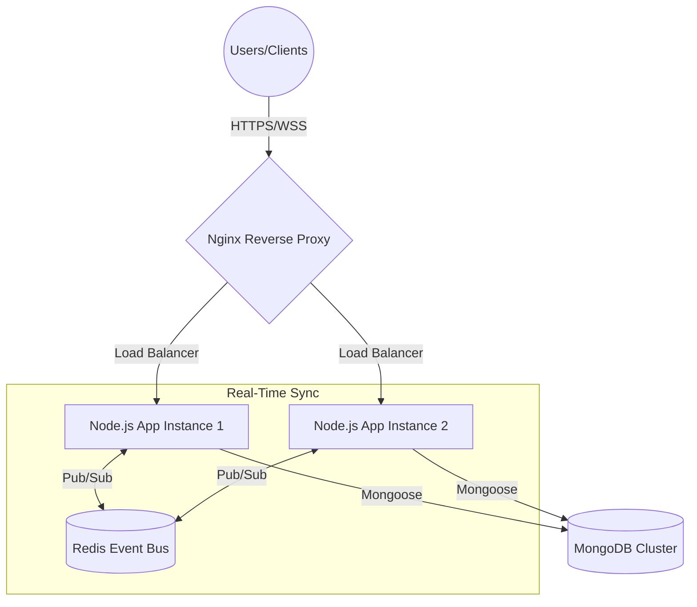

# System Design Document

## Project: Internal Project Management System (ProjectHub)

---

### 1. High-Level Architecture
The system follows a **N-Tier Client-Server Architecture** with a real-time event bus.



- **Frontend:** Next.js (React) SPA using Zustand for state management.
- **Backend:** Node.js/Express Micro-monolith.
- **Communication:** REST for state-changing CRUD; Socket.IO for state-synchronization.
- **In-Memory Store:** Redis serves as the Pub/Sub adapter for WebSocket horizontal scaling.
- **Database:** MongoDB (NoSQL) for document-based storage.

### 2. Database Schema (Collection Design)

#### 2.1 User Collection
```json
{
  "name": "String",
  "email": "String (Unique Index)",
  "password": "String (Hashed)",
  "role": "String (Enum: Admin, Member)"
}
```

#### 2.2 Project Collection
```json
{
  "name": "String",
  "description": "String",
  "visibility": "String (Enum: public, private)",
  "ownerId": "ObjectId (Ref: User)",
  "members": ["ObjectId (Ref: User)"]
}
```

#### 2.3 Task Collection
```json
{
  "title": "String",
  "description": "String",
  "status": "String (Enum: Todo, In Progress, Review, Done)",
  "priority": "String (Enum: low, medium, high)",
  "projectId": "ObjectId (Ref: Project - Indexed)",
  "imageUrls": ["String"],
  "links": ["String"],
  "position": "Number"
}
```

#### 2.4 Notification Collection
```json
{
  "message": "String",
  "type": "String (Enum: info, success, warning, error)",
  "userId": "ObjectId (Ref: User)",
  "projectId": "ObjectId (Ref: Project)",
  "createdAt": "Date (Timestamp)"
}
```

### 3. API Directory

| Endpoint | Method | Purpose |
| :--- | :--- | :--- |
| `/api/auth/login` | POST | Authenticate user & return JWT. |
| `/api/projects` | GET | List available projects for user. |
| `/api/projects` | POST | Create a new project. |
| `/api/projects/:id` | PUT | Update project metadata. |
| `/api/projects/:id` | DELETE | Remove project and associated tasks. |
| `/api/tasks` | GET | Fetch tasks for a specific projectId. |
| `/api/tasks` | POST | Create a new task (supports multipart image uploads). |
| `/api/tasks/:id` | PUT | Update task details or position. |
| `/api/tasks/:id/status` | PATCH | Transition task status (Todo -> Done). |
| `/api/notifications` | GET | Fetch persistent activity log. |
| `/api/analytics` | GET | Aggregate workspace stats. |

### 4. Real-Time Communication Strategy
We chose **WebSockets (Socket.IO)** with a **Redis Pub/Sub Adapter**.

- **Why this approach?** Unlike polling, WebSockets provide sub-100ms updates with low overhead.
- **Isolation via Rooms:** 
    - Upon joining a board, the client emits `room:join` with the `projectId`. 
    - The server adds that socket to a unique "Room" identified by that ID.
    - All subsequent `task:updated` or `task:created` events are broadcast strictly to that room (`io.to(projectId).emit(...)`).
    - This ensures that User A working on "Website Redesign" doesn't receive bandwidth-wasting updates for User B's "Mobile App" project.
- **Scalability:** The Redis adapter ensures that if Backend Instance 1 receives a status update, it broadcasts to clients connected to Instance 2, allowing for unlimited horizontal scaling.

### 5. Scalability Considerations
- **Database Indexing:** Composite indexes on `projectId` and `status` ensure Kanban fetches remain fast as the task count grows.
- **Stateless Auth:** JWT allows the backend to be stateless, making it easy to add/remove instances behind the Nginx load balancer.
- **Asset Optimization:** Frontend-side image compression prevents large binary blobs from bottlenecking the network.
